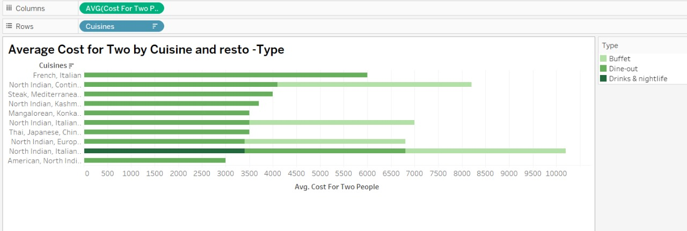
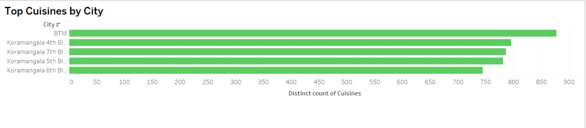
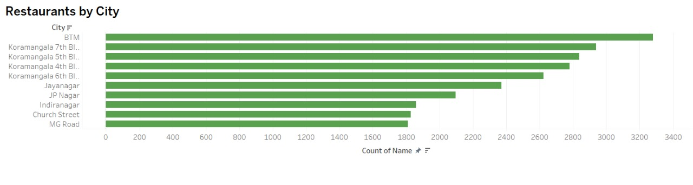
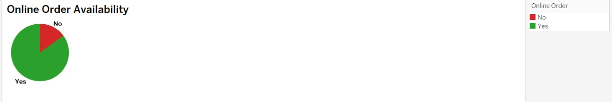
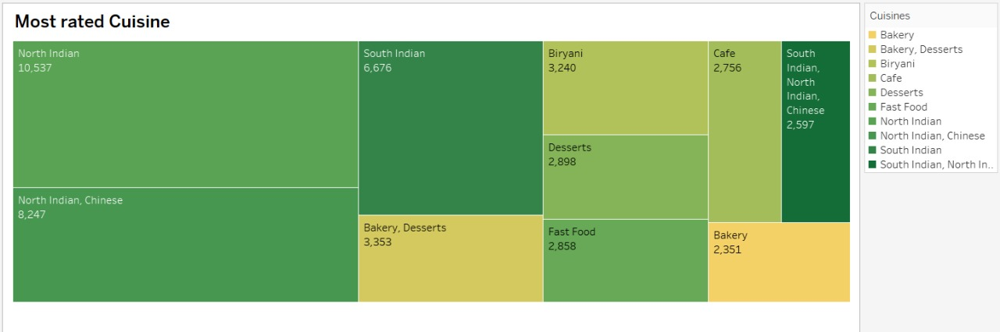

# Zomato_analysis
Zomato Restaurant Analysis by Top Cuisines by City, Average Cost for Two people, Restaurants by City and Online Order Availability.

The insights are based on visualizations created  in Tableau from the dataset.
## 📊 Dashboard Screenshot 
 

---

## 1.  Average Cost for Two by Cuisine and Restaurant Type
- **Insights:**
-  What it shows:
It compares the average cost for two people across different cuisine combinations and restaurant types (like Buffet, Dine-out, Drinks & Nightlife).
North Indian, Italian restaurants that offer Buffets charge close to ₹10,000 on average.
French/Italian Dine-out restaurants charge around ₹7,000.

## 📊 Dashboard Screenshots  

### Avgerage cost for two people 
  

---

## 2. Top Cuisines by City
- **Insights:**
-  What it shows:
This horizontal bar chart shows which city areas (like BTM, Koramangala, Jayanagar) have the highest number of distinct cuisines offered.
BTM offers the most variety in food types (~900 different cuisines).
Koramangala blocks (4th to 7th) also have a lot of food variety.

## 📊 Dashboard Screenshots  

### Top Cuisines by City
  

---

## 3. Restaurants by city
- **Insights:**
-  What it shows:
This chart shows how many restaurants are located in each city area.
BTM has the highest number of restaurants (~3,200).
Koramangala 7th, 5th, 4th Block also have many.
MG Road and Church Street have fewer restaurants than other places.

## 📊 Dashboard Screenshots  

### Resto by city
  

---

## 4. Online Order Availability
- **Insights:**
-  What it shows:
A pie chart showing how many restaurants allow online ordering.

✅ Yes (Green): Most restaurants offer online ordering (~612).

❌ No (Red): Only a small portion (~108) don’t allow online ordering.

## 📊 Dashboard Screenshots  

### Online Order Availability  
  

---

##  Key Takeaways
-BTM and Koramangala are top hubs for food, both in number of restaurants and variety.

-North Indian & Italian buffets are among the most expensive.

-Most restaurants allow online ordering.

-You can easily filter by location to explore different parts of the city.

---

## Bonous
5. Most rated cuisine
- Tells us how the food is rated accoeding to its type.
  
###  Most rated cuisine
  

